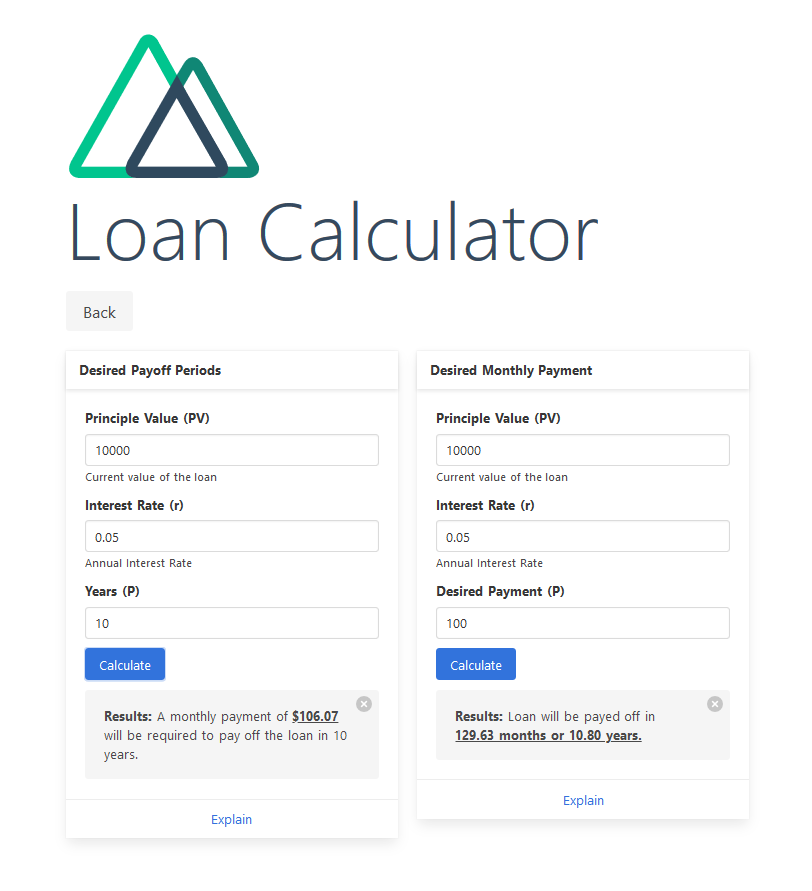

# cfl-tools-js

> Liberty Center for Financial Literacy Tools

As Requested by Liberty University's Center for Financial Literacy, the aim of this project is to develop a collection of simple  web-based financial tools for use by the center's mentors and mentees for educational purposes.



## Requirements

* NodeJS
* GitHub Desktop (Or Git for Windows for CLI Usage)
* npm
* Visial Studio Code (or other IDE)

## Made with

* NodeJS
* VueJS (Nuxt.js Framework)
* Bulma.css
* Nginx
* VS Code

## Build Setup

``` bash
# Clone Repo
$ git clone https://github.com/grplyler/cfl-tools-js

# Change Director
$ cd cfl-tools-js

# install dependencies
$ npm install

# serve with hot reload at localhost:3000
$ npm run dev

# build for production and launch server
$ npm run build
$ npm run start

# generate static project
$ npm run generate
```
